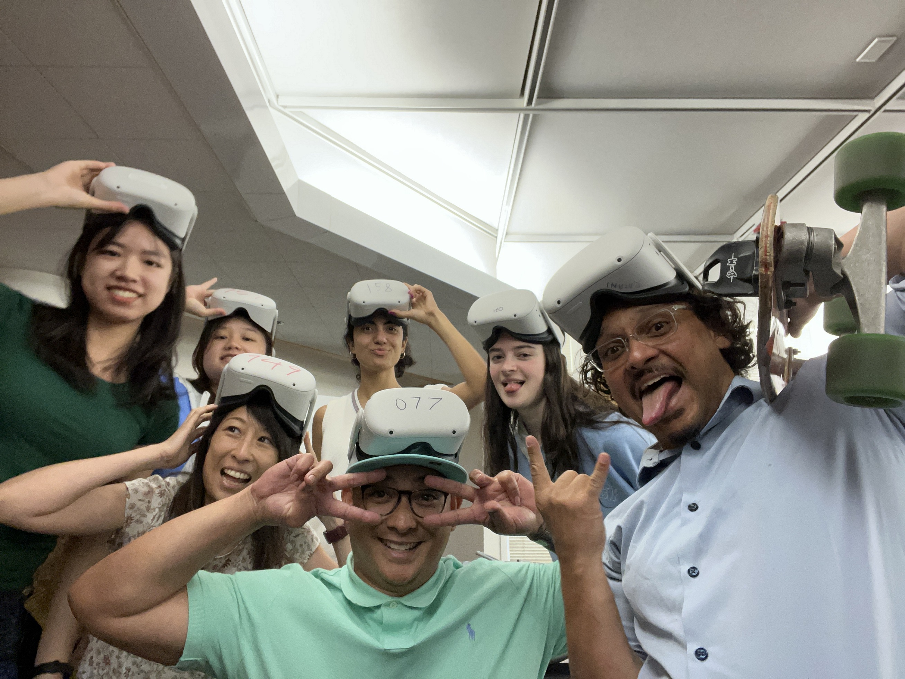

**Communication University of China**
**M.A.** in Communication, GPA: 3.99/4.00 (Top 5%), Sept. 2022 - Present
**B.A.** in Communication, GPA: 3.86/4.00 (Top 5%), Sept. 2018 - June 2022

**Stanford University 2023 Summer Session**, June 2023 - Aug. 2023
Coursework: Deception and Technology (A+/A+), Intro to Virtual Reality and Avatars (A+/A+), Digital Media and Personalization (A/A)
